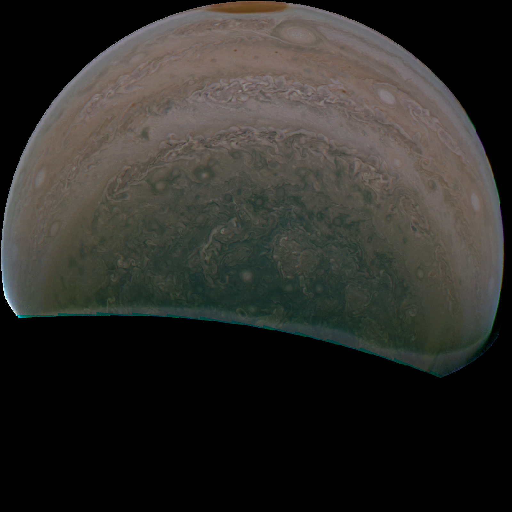
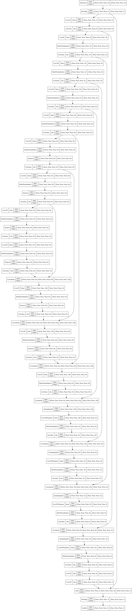

# junocam_GAN

Purpose: the idea here is to implement a GAN and train it to automatically process images of space. There's lots of unprocessed space data out there, and I've always wanted to make a data-driven solution to automating the processing of it. One can access raw images taken by spacecraft, for instance from the JunoCam project, found here: https://www.missionjuno.swri.edu/junocam/processing/

Here's an example of what we're trying to achieve. This photo shows the "before-and-after" of what the generative model does. On the left, we see the raw image, as taken by the JunoCAM itself. On the left, the image has been processed by one of my trained models. The difference is (in my opinion) remarkable--the model has learned aesthetics!

I feel that this project has now reached its logical end goal--high-resolution, enhanced-contrast, aesthetically pleasing images of Jupiter. I will note, however, that the engineering problem of training a GAN is not entirely complete, because the GAN still seems unstable. My favorite version of the generator (included in this repo) comes from epoch 66 out of 100--beyond this point, training destabilized again! So, the end goal of completing hundreds of epochs of training and reliably coming up with a good generator is still open to discussion, likely by iterating on the hyperparameters found in constants.py.

Speaking of individual files, here's a rundown of what you'll find in this repo and what you should perhaps make for yourself:

Folders:
1. checkpoint_imgs should be empty at the start of training; the training process will output example images from the generator so that you can keep track of how training is progressing
2. ckpts contains checkpoints of the entire GAN model (that is, the WEIGHTS of the generator and discriminator)
3. cookiecut_raw_imgs and cookiecut_user_imgs contains "cutouts" of the original images. We train directly on these, rather than on the full 1600x1600 images, because it is more memory-efficient
4. fake_images contains images created by the junoGen once one runs junoGen.py
5. junoGen contains an instance of the generator. This can then be loaded like so `trained_gen = tf.keras.models.load_model('junoGen')` in order to process some images
6. raw_imgs contains the images downloaded from the junoCAM website taken by the spacecraft itself!
7. user_imgs contains the images downloaded from the junoCAM website that have been edited by users--or any other "already-pretty" space images one would be so inclined to mimic

Files:
1. .gitignore tells git to ignore committing/pushing certain files because I don't want to fill github with junk
2. architecture.py describes how my models are made
3. comparison.PNG provides a glimpse of what the generator is actually doing, a "before-and-after" image
4. constants.py controls certain global variables, many of which are hyperparameters for training
5. cookieCutter.py processes the raw and user images into smaller images for the GAN to train on, so that the GAN doesn't have to waste time processing a huge file each and every time
6. discriminator_plot.png is a visualization of the discriminator
7. favorite_output.png is a full-res example of what the generator can make. Very pretty!
8. generator_plot.png is a visualization of the generator
9. junoGAN.py describes the training process of the GAN
10. junoGen_from_checkpoint.py and junoGen_from_generator.py describe two ways of generating outputs from the trained GAN.
11. README.md is this file
12. scraper.py scrapes images from the junoCAM website, not very well
13. test.py is just some junk code that I used to test certain tensorflow/numpy files

Here's some visualizations of the models:

